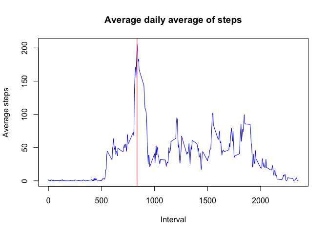
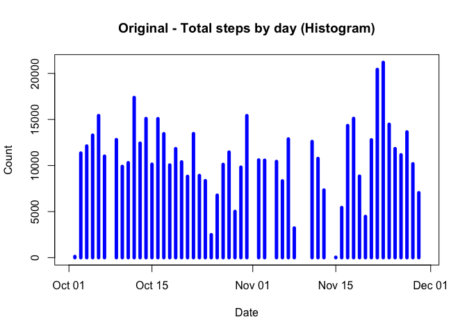
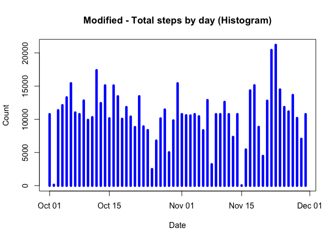
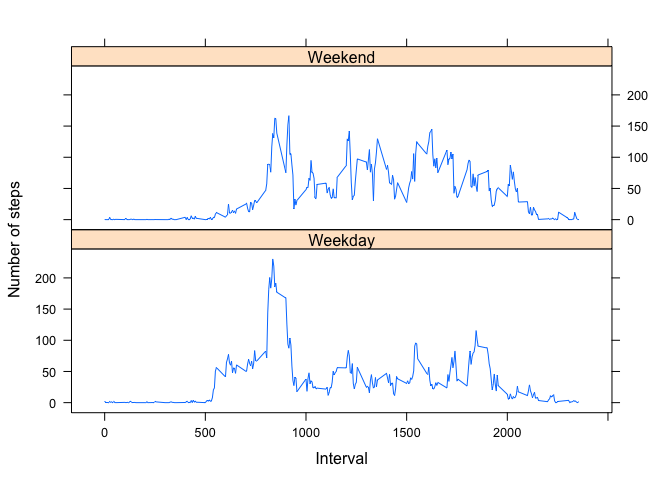

# Reproducible Research: Peer Assessment 1

## Loading and preprocessing the data


```r
# Unzip and read the activity input file and
# transform the 'date' column into a Date type field.
unzip("activity.zip")
data <- read.csv("activity.csv", colClasses = c("integer", "Date", "integer"))
```

## What is mean total number of steps taken per day?


```r
daily_sum <- aggregate(data$steps, list(data$date), FUN=sum)
daily_sum <- setNames(daily_sum, c(names(data[2]),names(data[1])))
plot(daily_sum$date, daily_sum$steps, type="h", main="Total steps by day (Histogram)",
     xlab="Date", ylab="Count", col="blue", lwd=5)
```

\

Mean of the total number of steps taken per day


```r
setNames(aggregate(data$steps, list(data$date),
                   FUN=mean, na.action=na.omit),
         c(names(data[2]),"meanDailySteps"))
```

```
##          date meanDailySteps
## 1  2012-10-01             NA
## 2  2012-10-02      0.4375000
## 3  2012-10-03     39.4166667
## 4  2012-10-04     42.0694444
## 5  2012-10-05     46.1597222
## 6  2012-10-06     53.5416667
## 7  2012-10-07     38.2465278
## 8  2012-10-08             NA
## 9  2012-10-09     44.4826389
## 10 2012-10-10     34.3750000
## 11 2012-10-11     35.7777778
## 12 2012-10-12     60.3541667
## 13 2012-10-13     43.1458333
## 14 2012-10-14     52.4236111
## 15 2012-10-15     35.2048611
## 16 2012-10-16     52.3750000
## 17 2012-10-17     46.7083333
## 18 2012-10-18     34.9166667
## 19 2012-10-19     41.0729167
## 20 2012-10-20     36.0937500
## 21 2012-10-21     30.6284722
## 22 2012-10-22     46.7361111
## 23 2012-10-23     30.9652778
## 24 2012-10-24     29.0104167
## 25 2012-10-25      8.6527778
## 26 2012-10-26     23.5347222
## 27 2012-10-27     35.1354167
## 28 2012-10-28     39.7847222
## 29 2012-10-29     17.4236111
## 30 2012-10-30     34.0937500
## 31 2012-10-31     53.5208333
## 32 2012-11-01             NA
## 33 2012-11-02     36.8055556
## 34 2012-11-03     36.7048611
## 35 2012-11-04             NA
## 36 2012-11-05     36.2465278
## 37 2012-11-06     28.9375000
## 38 2012-11-07     44.7326389
## 39 2012-11-08     11.1770833
## 40 2012-11-09             NA
## 41 2012-11-10             NA
## 42 2012-11-11     43.7777778
## 43 2012-11-12     37.3784722
## 44 2012-11-13     25.4722222
## 45 2012-11-14             NA
## 46 2012-11-15      0.1423611
## 47 2012-11-16     18.8923611
## 48 2012-11-17     49.7881944
## 49 2012-11-18     52.4652778
## 50 2012-11-19     30.6979167
## 51 2012-11-20     15.5277778
## 52 2012-11-21     44.3993056
## 53 2012-11-22     70.9270833
## 54 2012-11-23     73.5902778
## 55 2012-11-24     50.2708333
## 56 2012-11-25     41.0902778
## 57 2012-11-26     38.7569444
## 58 2012-11-27     47.3819444
## 59 2012-11-28     35.3576389
## 60 2012-11-29     24.4687500
## 61 2012-11-30             NA
```
Observation: A few days have all 'NA' values for steps, that results in 'NA' mean for those days. There is no optimization done to remove NAs as it's not required as per instructions for this step.


Median of the total number of steps taken per day


```r
setNames(aggregate(data$steps, list(data$date), FUN=median, na.rm=TRUE),
         c(names(data[2]),"medianDailySteps"))
```

```
##          date medianDailySteps
## 1  2012-10-01               NA
## 2  2012-10-02                0
## 3  2012-10-03                0
## 4  2012-10-04                0
## 5  2012-10-05                0
## 6  2012-10-06                0
## 7  2012-10-07                0
## 8  2012-10-08               NA
## 9  2012-10-09                0
## 10 2012-10-10                0
## 11 2012-10-11                0
## 12 2012-10-12                0
## 13 2012-10-13                0
## 14 2012-10-14                0
## 15 2012-10-15                0
## 16 2012-10-16                0
## 17 2012-10-17                0
## 18 2012-10-18                0
## 19 2012-10-19                0
## 20 2012-10-20                0
## 21 2012-10-21                0
## 22 2012-10-22                0
## 23 2012-10-23                0
## 24 2012-10-24                0
## 25 2012-10-25                0
## 26 2012-10-26                0
## 27 2012-10-27                0
## 28 2012-10-28                0
## 29 2012-10-29                0
## 30 2012-10-30                0
## 31 2012-10-31                0
## 32 2012-11-01               NA
## 33 2012-11-02                0
## 34 2012-11-03                0
## 35 2012-11-04               NA
## 36 2012-11-05                0
## 37 2012-11-06                0
## 38 2012-11-07                0
## 39 2012-11-08                0
## 40 2012-11-09               NA
## 41 2012-11-10               NA
## 42 2012-11-11                0
## 43 2012-11-12                0
## 44 2012-11-13                0
## 45 2012-11-14               NA
## 46 2012-11-15                0
## 47 2012-11-16                0
## 48 2012-11-17                0
## 49 2012-11-18                0
## 50 2012-11-19                0
## 51 2012-11-20                0
## 52 2012-11-21                0
## 53 2012-11-22                0
## 54 2012-11-23                0
## 55 2012-11-24                0
## 56 2012-11-25                0
## 57 2012-11-26                0
## 58 2012-11-27                0
## 59 2012-11-28                0
## 60 2012-11-29                0
## 61 2012-11-30               NA
```

Observation: Median is all 0s or NAs.  
It's not an error. Interestingly (but not surprisingly), there are a lot of 0 values for many of the intervals of each day which results in 0 being at the 50th percentile of the dataset for each day, which is the median for the given day.  
There is no optimization done to remove NAs as it's not required as per instructions for this step. That resulted in some 'NA's in median.


## What is the average daily activity pattern?


```r
mean_steps_by_time <- aggregate(data$steps, list(data$interval), FUN=mean, na.rm=TRUE)
mean_steps_by_time <- setNames(mean_steps_by_time, c(names(data[3]), names(data[1])))

plot(mean_steps_by_time, type="l", xlab="Interval", ylab="Average steps", col="blue",
     main="Average daily average of steps")

# Highlight the time of day with maximum daily average number of steps.
max_loc <- which(mean_steps_by_time$steps == max(mean_steps_by_time$steps))
max_interval <- mean_steps_by_time[max_loc,]$interval
abline(v = max_interval, col = "red")
```

\

Therefore, the 5-minute interval on average across all the days in the dataset, that contains the maximum number of steps is the one that corresponds to interval 835.  
*(A sidenote: the interval above is obtained using embedded R scirpt, not hard-coded).*


## Imputing missing values

There are 2304 NA values for steps in the dataset.    
  The strategy to get rid of these NA values in the 'steps' column is by replacing them with the daily average steps for the same intervals across the entire dataset.  
*(A sidenote: the count above is obtained using embedded R scirpt, not hard-coded).*


```r
obs_per_day <- nrow(mean_steps_by_time)
new_data <- data
na_rows <- which(is.na(new_data$steps))
for(i in 1:length(na_rows)) {
    r <- na_rows[i]
    mean_index <- r%%obs_per_day
    if (mean_index == 0) {
        mean_index = obs_per_day
    }
    new_data[r,]$steps <- mean_steps_by_time[mean_index,]$steps
}
```

Now, we'll plot the histogram of sum of steps of the modified data and let us compare it with the original one.


```r
# Let us plot the original data one more time for comparison.
plot(daily_sum$date, daily_sum$steps, type="h",
     main="Original - Total steps by day (Histogram)",
     xlab="Date", ylab="Count", col="blue", lwd=5)
```

\

```r
# Now, let us plot the modified data.
daily_sum <- aggregate(new_data$steps, list(new_data$date), FUN=sum)
daily_sum <- setNames(daily_sum, c(names(new_data[2]),names(new_data[1])))
plot(daily_sum$date, daily_sum$steps, type="h",
     main="Modified - Total steps by day (Histogram)",
     xlab="Date", ylab="Count", col="blue", lwd=5)
```

\

As you can see from these two plots, overall there is no major noticable change.   However, the biggest change in aggregate steps is for the days where there were all NA values before.

Mean of the total number of steps taken per day


```r
setNames(aggregate(new_data$steps, list(new_data$date),
                   FUN=mean, na.action=na.omit),
         c(names(new_data[2]),"meanDailySteps"))
```

```
##          date meanDailySteps
## 1  2012-10-01     37.3825996
## 2  2012-10-02      0.4375000
## 3  2012-10-03     39.4166667
## 4  2012-10-04     42.0694444
## 5  2012-10-05     46.1597222
## 6  2012-10-06     53.5416667
## 7  2012-10-07     38.2465278
## 8  2012-10-08     37.3825996
## 9  2012-10-09     44.4826389
## 10 2012-10-10     34.3750000
## 11 2012-10-11     35.7777778
## 12 2012-10-12     60.3541667
## 13 2012-10-13     43.1458333
## 14 2012-10-14     52.4236111
## 15 2012-10-15     35.2048611
## 16 2012-10-16     52.3750000
## 17 2012-10-17     46.7083333
## 18 2012-10-18     34.9166667
## 19 2012-10-19     41.0729167
## 20 2012-10-20     36.0937500
## 21 2012-10-21     30.6284722
## 22 2012-10-22     46.7361111
## 23 2012-10-23     30.9652778
## 24 2012-10-24     29.0104167
## 25 2012-10-25      8.6527778
## 26 2012-10-26     23.5347222
## 27 2012-10-27     35.1354167
## 28 2012-10-28     39.7847222
## 29 2012-10-29     17.4236111
## 30 2012-10-30     34.0937500
## 31 2012-10-31     53.5208333
## 32 2012-11-01     37.3825996
## 33 2012-11-02     36.8055556
## 34 2012-11-03     36.7048611
## 35 2012-11-04     37.3825996
## 36 2012-11-05     36.2465278
## 37 2012-11-06     28.9375000
## 38 2012-11-07     44.7326389
## 39 2012-11-08     11.1770833
## 40 2012-11-09     37.3825996
## 41 2012-11-10     37.3825996
## 42 2012-11-11     43.7777778
## 43 2012-11-12     37.3784722
## 44 2012-11-13     25.4722222
## 45 2012-11-14     37.3825996
## 46 2012-11-15      0.1423611
## 47 2012-11-16     18.8923611
## 48 2012-11-17     49.7881944
## 49 2012-11-18     52.4652778
## 50 2012-11-19     30.6979167
## 51 2012-11-20     15.5277778
## 52 2012-11-21     44.3993056
## 53 2012-11-22     70.9270833
## 54 2012-11-23     73.5902778
## 55 2012-11-24     50.2708333
## 56 2012-11-25     41.0902778
## 57 2012-11-26     38.7569444
## 58 2012-11-27     47.3819444
## 59 2012-11-28     35.3576389
## 60 2012-11-29     24.4687500
## 61 2012-11-30     37.3825996
```

Observation: There are some changes to the mean data after the NA values are filled.   Still, overall the change is not substantial. However, the biggest change is for the days where we had all NA values before. 


Median of the total number of steps taken per day


```r
setNames(aggregate(new_data$steps, list(new_data$date), FUN=median, na.rm=TRUE),
         c(names(new_data[2]),"medianDailySteps"))
```

```
##          date medianDailySteps
## 1  2012-10-01         34.11321
## 2  2012-10-02          0.00000
## 3  2012-10-03          0.00000
## 4  2012-10-04          0.00000
## 5  2012-10-05          0.00000
## 6  2012-10-06          0.00000
## 7  2012-10-07          0.00000
## 8  2012-10-08         34.11321
## 9  2012-10-09          0.00000
## 10 2012-10-10          0.00000
## 11 2012-10-11          0.00000
## 12 2012-10-12          0.00000
## 13 2012-10-13          0.00000
## 14 2012-10-14          0.00000
## 15 2012-10-15          0.00000
## 16 2012-10-16          0.00000
## 17 2012-10-17          0.00000
## 18 2012-10-18          0.00000
## 19 2012-10-19          0.00000
## 20 2012-10-20          0.00000
## 21 2012-10-21          0.00000
## 22 2012-10-22          0.00000
## 23 2012-10-23          0.00000
## 24 2012-10-24          0.00000
## 25 2012-10-25          0.00000
## 26 2012-10-26          0.00000
## 27 2012-10-27          0.00000
## 28 2012-10-28          0.00000
## 29 2012-10-29          0.00000
## 30 2012-10-30          0.00000
## 31 2012-10-31          0.00000
## 32 2012-11-01         34.11321
## 33 2012-11-02          0.00000
## 34 2012-11-03          0.00000
## 35 2012-11-04         34.11321
## 36 2012-11-05          0.00000
## 37 2012-11-06          0.00000
## 38 2012-11-07          0.00000
## 39 2012-11-08          0.00000
## 40 2012-11-09         34.11321
## 41 2012-11-10         34.11321
## 42 2012-11-11          0.00000
## 43 2012-11-12          0.00000
## 44 2012-11-13          0.00000
## 45 2012-11-14         34.11321
## 46 2012-11-15          0.00000
## 47 2012-11-16          0.00000
## 48 2012-11-17          0.00000
## 49 2012-11-18          0.00000
## 50 2012-11-19          0.00000
## 51 2012-11-20          0.00000
## 52 2012-11-21          0.00000
## 53 2012-11-22          0.00000
## 54 2012-11-23          0.00000
## 55 2012-11-24          0.00000
## 56 2012-11-25          0.00000
## 57 2012-11-26          0.00000
## 58 2012-11-27          0.00000
## 59 2012-11-28          0.00000
## 60 2012-11-29          0.00000
## 61 2012-11-30         34.11321
```

Observation: The median remains at 0 as before for most of the days.  However, for the days where we had all NA values before, the new dataset has median values of that is not 0 or NA.

## Are there differences in activity patterns between weekdays and weekends?

Let us split the transformed data into weekday and weekend data and plot the average steps for each to answer this question.


```r
# split the data into two sets
suppressMessages(library(lubridate))
suppressMessages(library(lattice))
suppressMessages(library(plyr))

wdays <- wday(new_data$date)
# Add a day indicator column
trans_data <- transform(new_data, day = wdays)
# Add Weekend/Weekday label column
trans_data$wd_we <- ifelse(trans_data$day %in% c(1, 7), "Weekend", "Weekday")
# Calculate the mean for weekends and weekdays steps using plyr package
mean_steps <- ddply(trans_data, .(interval, wd_we), summarise, steps = mean(steps))
# Plot it as specified in the specfification
xyplot(steps ~ interval | wd_we, data = mean_steps, layout = c(1, 2), type = "l",
       xlab="Interval", ylab="Number of steps")
```

\

Based on the above two plots, we can see that irrespective of whether the day is a weekend or weekday, the activity between intervals 0 to 530 and 2100 to 2355 are pretty much the same. This corresponds to the time between 9:00 pm and 5:30 am, when the subject is likely sleeping/resting.   On weekdays, there is a lot more activity during 800 and 900 compared to the weekends. Whereas on weekends, there are spikes in activities at various intervals between 1000 and 1600, that are higher compared to the same period on weekdays.    


